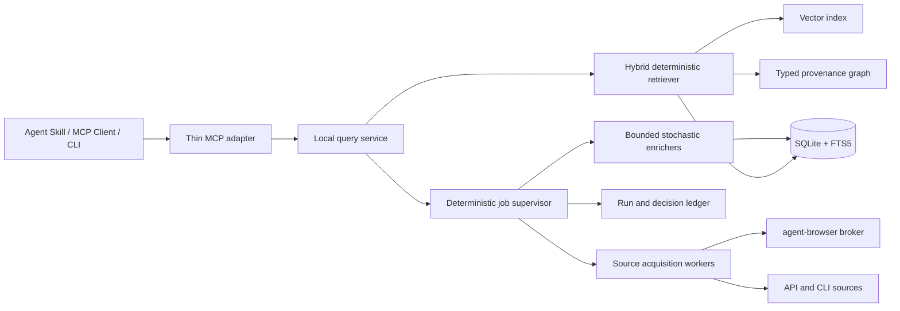

# Plan 0007 | Productized intelligence service MVP

State: OPEN
Date: 2026-07-24

## Execution State

Plan version: 1
Critical-path owner: primary agent
Execution branch: `main`
Optimization posture: balanced parallelism with disjoint write scopes

Local goal bounds:

- maximum work-unit attempts: 2;
- maximum review/rework cycles per packet: 1;
- maximum consecutive hardening-only checkpoints: 2;
- checkpoint interval: after every validated implementation packet;
- active subagent concurrency: at most 2 sidecar lanes plus the critical-path
  owner;
- retry and review loops must end in pass, split, reframe, operator gate, or
  explicit failure after their bound.

Required checkpoint fields:

- checkpoint ID and plan version;
- state transition;
- progress classification;
- owned changes;
- validation evidence;
- subagent status and reconciliation;
- remaining acceptance criteria;
- next action or stop reason.

### Checkpoint P0007-C00 | 2026-07-24

State transition: `planned -> active`

Progress classification: `outcome_progress`

Current authority and evidence:

- this plan is the governing implementation authority;
- commit `32e4209` records the researched MVP design;
- the worktree was clean before execution and `main` was four commits ahead of
  `origin/main`;
- the existing Python pipeline, SQLite/FTS5 store, watchlists, browser-backed
  source adapters, and one-tool Go MCP wrapper are the migration starting
  point;
- Codex CLI 0.145.0 passed the app-server readiness check with stdio, Unix
  socket, schema-generation, and authenticated WebSocket capabilities.

Unmet acceptance state:

- all six implementation packets and every acceptance criterion remain open;
- no new service runtime, cache-first query authority, durable acquisition
  supervisor, semantic index, typed graph projection, thin MCP surface, or App
  Intelligence maintenance loop has shipped yet.

Ready work:

- Packet 1 service contracts, schemas, migrations, ADR, and golden tests;
- disjoint sidecar discovery of the Go MCP transport/package surface;
- disjoint sidecar review of validation, packaging, and operator-runtime
  requirements.

Blocked work:

- none;
- live authenticated-source validation and final push remain later explicit
  runtime/integration gates.

Delegation decision:

- `spawned` is required for bounded, disjoint sidecar discovery and later
  independent review under Policies 0015 and 0021;
- MCP transport/package audit handle: `/root/mcp_surface_audit`, read-only,
  terminal status pending;
- runtime/package/validation audit handle: `/root/runtime_validation_audit`,
  read-only, terminal status pending;
- delegated workers may not edit the Packet 1 schema/store critical path unless
  ownership is explicitly reassigned;
- the primary agent owns integration and independently verifies delegated
  evidence.

Human, security, and runtime gates:

- no autonomous login, CAPTCHA, checkpoint, credential, or account recovery;
- no remote WebSocket service surface without a separately approved auth and
  network boundary;
- no model-authored repair may self-deploy;
- final publication requires repository validation, installed-client smokes,
  and a truthful push/readback.

### Checkpoint P0007-C01 | 2026-07-24

Plan version: 1

State transition: `packet_1_active -> packet_1_complete`

Progress classification: `outcome_progress`

Owned changes:

- accepted ADR 0001 for the local service, package, transport, configuration,
  credential, cache, MCP, persistence, and deterministic-supervisor seams;
- added canonical v1 JSON Schemas and strict Python contracts for query,
  evidence, acquisition, job, event, and decision envelopes;
- added stable configuration profile IDs without placing credentials in
  envelopes;
- added retention/redaction classes and recursive rejection of credential,
  browser lease, session, route, display, tab, and operator URL fields in
  replay payloads;
- added SQLite schema version 3 for service envelopes, jobs, events,
  acquisitions, documents, FTS, chunks, embeddings, graph projections, index
  versions, decisions, and eval results;
- made migrations reject newer schemas, serialize concurrent upgrades, and
  roll back a failed migration atomically;
- added a deep `ServiceStore` interface with canonical JSON, SHA-256 integrity,
  idempotent writes, immutable-ID conflict detection, and contract
  revalidation on read;
- commit `01a65b4` records the Packet 1 implementation.

Validation evidence:

- `uv run pytest`: 2,118 passed, 7 skipped, 6 subtests passed;
- focused contract/store/migration suite: 42 passed;
- fresh, legacy, concurrent, rollback, integrity, and foreign-key migration
  cases passed;
- all six v1 envelopes round-tripped through the durable store;
- skill artifact test proved the contract, store, and schema files ship inside
  the recursive Agent Skills boundary;
- `go test ./...` passed for engine, manifest, and tools;
- Python compilation, JSON catalog parsing, and `git diff --check` passed.

Subagent status and reconciliation:

- `/root/mcp_surface_audit`: terminal success, read-only; its current call flow,
  package constraints, tool mapping, annotation conflict, and test
  recommendations were reviewed by the primary agent;
- `/root/runtime_validation_audit`: terminal success, read-only; its package
  boundary, configuration authority, systemd PATH, migration, platform, and CI
  findings were reviewed by the primary agent;
- the primary agent independently ran the Go tests and reconciled both reports
  into ADR 0001;
- the MCP audit's annotation finding changed `query` to truthful
  non-read-only/open-world semantics when `prefer_cache` schedules refresh;
- the runtime audit's credential/config finding added named user-scoped
  profiles and made packaged daemon bootstrap a release gate.

Remaining acceptance state:

- Packets 2 through 6 remain open;
- no service process, socket query interface, retrieval index, acquisition
  supervisor, thin MCP client, installed service, or maintenance loop is
  claimed yet.

Next action:

- execute Packet 2 as a bounded cache-first query service slice, with a real
  Unix-socket subprocess fixture and warm-query no-network proof.

Packet 2 delegation receipt:

- `/root/packet2_retrieval`: spawned, owns only the new retrieval module and
  its focused tests, terminal success;
- `/root/packet2_socket_audit`: spawned read-only for adversarial socket
  lifecycle and no-network proof design, terminal success;
- the primary agent owns query/response contracts, service host, transport,
  lifecycle, integration, and final verification.

### Checkpoint P0007-C02 | 2026-07-24

Plan version: 1

State transition: `packet_2_active -> packet_2_complete`

Progress classification: `outcome_progress`

Owned changes:

- added a user-scoped Python service with private HTTP/JSON over a Unix socket,
  singleton locking, stale-socket recovery, same-user peer checks, fixed error
  envelopes, bounded request/response transport, and graceful signal cleanup;
- chose HTTP/JSON over the socket-audit lane's NDJSON sketch because the
  accepted boundary requires a thin multi-language client and the Go MCP can
  use this request/response transport without embedding Python or learning the
  storage schema;
- indexed legacy findings into immutable acquisition, document, chunk, and
  published index snapshots with stable IDs and content hashes;
- added FTS5/BM25 retrieval, injected versioned embeddings, exact cosine
  similarity, weighted reciprocal-rank fusion, deterministic ordering, source
  filters, exact snapshot membership, and lexical-only degradation;
- added transport-independent health, dynamic capability discovery, cache
  freshness, bounded evidence, deterministic extractive briefs, and optional
  refresh scheduling seams;
- bounded request IDs and complete serialized responses, including the legal
  512-character minimum;
- moved SQLite busy-timeout setup ahead of WAL activation so concurrent
  initializers wait instead of intermittently failing before migration locks;
- documented the new user-scoped socket and database configuration overrides;
- commit `0057c6e` records the Packet 2 implementation.

Validation evidence:

- `uv run pytest`: 2,137 passed, 7 skipped, 6 subtests passed;
- post-review Packet 2 contract, application, transport, subprocess,
  retrieval, store, migration, and artifact gate: 38 passed;
- concurrent migration initialization passed ten consecutive stress runs;
- a real subprocess canary rejected all Internet socket use, subprocess
  acquisition, and source/browser module imports while `cache_only` and fresh
  `prefer_cache` queries returned cited evidence without changing job, event,
  or acquisition ledger counts;
- 100 real Unix-socket warm queries measured 1.343 ms median, 1.846 ms p95,
  and 2.183 ms maximum, with one cited result and an exact published index
  version;
- stale sockets were recovered; regular files, dangling symlinks, a second
  service owner, malformed contracts, and attacker-controlled error text were
  handled without unsafe deletion or reflection;
- service shutdown returned zero, emitted no stdout, removed only its owned
  socket inode, and left runtime/data directories at `0700` and socket, lock,
  and database files at `0600`;
- Python compilation, JSON catalog parsing, skill artifact coverage, and
  `git diff --check` passed.

Subagent status and reconciliation:

- `/root/packet2_retrieval`: terminal success; the primary agent reviewed and
  extended its retrieval module with content-addressed published index
  manifests and exact `index_documents` membership before integration;
- `/root/packet2_socket_audit`: terminal success, read-only; the primary agent
  converted its lock, ownership, stale-path, peer, no-network, import-canary,
  permission, and signal recommendations into implementation and adversarial
  tests;
- the proposed NDJSON wire format was deliberately not adopted; HTTP/JSON over
  the same private Unix socket better preserves the thin Python/Go seam while
  retaining the audit's local-only security boundary.

Remaining acceptance state:

- Packets 3 through 6 remain open;
- refresh scheduling is still only an application seam: there is no durable
  acquisition supervisor, lease recovery, retry/negative-cache policy,
  source-worker execution, semantic background worker, graph expansion, thin
  MCP cutover, installed service, or App Intelligence maintenance loop yet.

Next action:

- execute Packet 3 as a bounded deterministic-supervisor slice: durable
  deduplicated refresh jobs, leases and recovery, event replay, retry/budget
  policy, negative caching, stale-while-revalidate, partial publication, and
  explicit `awaiting_operator` mapping.

### Checkpoint P0007-C03 | 2026-07-24

Plan version: 1

State transition: `packet_3_active -> packet_3_complete`

Progress classification: `outcome_progress`

Owned changes:

- added schema version 4 for durable refresh timing, spend, lease generation,
  and per-profile/query/source coverage, including safe applied-v3 upgrades;
- added a deterministic supervisor with normalized refresh coalescing, strict
  state transitions, append-only sequenced events, lease renewal/recovery and
  generation fencing, retry taxonomy, attempt/cost ceilings, negative caching,
  operator waits, and explicit operator resume;
- added versioned request/result worker contracts with safe codes, timezone
  validation, status/retry invariants, recursive secret/browser-field
  rejection, item/network/time/cost bounds, and immutable replay storage;
- added a process-isolated source worker for Reddit, X, YouTube, Facebook, and
  LinkedIn using named user-scoped profiles, public-first Reddit with the
  supported ScrapeCreators fallback key, and typed auth/rate/config/content
  outcomes;
- added bounded stdout/stderr streaming, process-group timeout and shutdown
  cancellation, adapter import isolation, and host-reserved adapter cost
  ceilings;
- added stale-while-revalidate scheduling, explicit successful empty-result
  coverage, partial source publication, deterministic retry delays, and
  background service execution;
- made result acceptance, replay envelopes, acquisitions, document projection,
  chunks, and sightings one live lease-fenced transaction so stale workers
  cannot publish after reclaim;
- made same-URL content refresh revision-aware: the current document and chunk
  advance atomically while acquisition envelopes and sightings preserve the
  prior observations;
- made discovery distinguish configured from acquisition-ready sources and
  report a degraded service when the acquisition loop fails while cached
  queries remain available;
- generated CLI request IDs by default instead of reusing one immutable ledger
  key across unrelated queries;
- documented service profile resolution, source behavior, readiness, and
  resource-budget semantics;
- commit `23d3540` records the Packet 3 implementation.

Validation evidence:

- `uv run pytest`: the complete 2,187-test collection passed;
- focused post-review service contract, migration, store, supervisor, worker,
  acquisition, refresh, publication, job-runner, runtime, application,
  transport, subprocess, and artifact gate: 75 passed;
- stale-generation publication was rejected before any envelope, acquisition,
  or document write;
- two acquisitions of the same URL with changed text advanced the searchable
  current projection while retaining two acquisition and sighting records;
- concurrent equivalent refreshes produced one durable job; expired leases
  were reclaimed with generation fencing; multi-source work renewed its lease;
- transient failures released leases into bounded backoff, authentication
  mapped to `awaiting_operator`, zero-result success suppressed redundant
  refresh, and a host budget of zero prevented the paid fallback from
  launching;
- warm cache-only and fresh prefer-cache service queries still triggered no
  network, subprocess, or acquisition imports;
- stdout and stderr overflow, wall timeout, stale worker results, invalid safe
  codes/timestamps, cancellation, profile scope, and network-zero gates passed;
- Python compilation, JSON catalog parsing, packaged-skill contents, and
  `git diff --check` passed.

Subagent status and reconciliation:

- `/root/packet3_supervisor_store`: terminal success; its supervisor module and
  focused tests were reviewed, integrated, and extended by the primary agent
  with the shared WAL-lock fix and coverage readback;
- `/root/packet3_pipeline_audit`: first terminal success as a read-only source
  boundary audit, then terminal success as the independent Packet 3 evaluator;
- the evaluator reported two blockers and eight high/medium findings; the
  primary agent completed the packet's single allowed rework pass, including
  lease-fenced publication, revision-aware refresh, renewed leases, bounded
  streams, cancellation, Reddit routing, host cost reservation, collision-safe
  CLI IDs, strict worker validation, and truthful readiness;
- the evaluator's observation that publication, coverage, and terminal state
  remain separate crash points is reconciled through fenced, content-addressed,
  idempotent replay; a future transactional outbox is optional hardening, not
  required for the Packet 3 exit gate;
- external tools cannot expose each internal network attempt to the Python
  counter, so they remain bounded by one isolated launch, wall time, output,
  item, cost, and process-group limits.

Remaining acceptance state:

- Packets 4 through 6 remain open;
- semantic background embeddings, deterministic entity extraction, typed graph
  projection/expansion, MCP cutover, installed-client smokes, and App
  Intelligence maintenance/evaluation loops remain unclaimed;
- live authenticated X/Facebook/LinkedIn and real YouTube/Reddit acquisition
  smokes remain final runtime gates and may require operator-owned sessions.

Next action:

- execute Packet 4 as a bounded deterministic enrichment slice: versioned
  background embeddings, entity extraction and resolution, accepted typed
  relationships with evidence, graph expansion, and lexical-only degradation.

## Objective

Turn last30days from a request-scoped research engine into a local-first,
cache-backed intelligence service that agents can discover and query without
learning how to operate browsers, scrape individual sources, recover sessions,
or interpret source-specific diagnostics.

The service must make the common path small:

1. discover service capabilities;
2. query cached intelligence;
3. receive a compact answer or evidence packet with citations;
4. request or observe a refresh only when freshness requires it.

Acquisition mechanics, authentication, browser coordination, retries,
normalization, indexing, enrichment, and repair diagnostics remain behind the
service boundary.

## Product Vision

The durable service becomes the intelligence product. The Agent Skill, direct
CLI, and MCP server become client surfaces over one shared service contract.

The service continuously turns source observations into a versioned local
knowledge base:

- source retrieval is asynchronous and cache-aware;
- every claim remains traceable to source evidence and an acquisition run;
- lexical, semantic, recency, source-quality, and graph signals are combined by
  a deterministic ranker;
- stochastic agents perform bounded enrichment, synthesis, evaluation, and
  maintenance recommendations;
- a deterministic supervisor owns scheduling, budgets, state transitions,
  validation, retries, approvals, and replay.

The normal querying agent must not receive browser commands, page dumps, cookie
details, scrape logs, or enrichment transcripts. Those are operator
diagnostics, available only through an explicit diagnostic surface.

## Research Basis

This design follows four current primary-source findings:

- MCP servers expose capabilities through protocol discovery, including
  `tools/list`; tools and resources should present a concise service contract
  rather than require clients to know implementation mechanics. See the
  [MCP architecture documentation](https://modelcontextprotocol.io/docs/learn/architecture).
- MCP Tasks can represent long-running work, but they were introduced in the
  2025-11-25 specification and remain experimental. The MVP therefore returns
  durable service job IDs and offers an explicit status tool; a future adapter
  may map those jobs onto MCP Tasks when client support is dependable. See the
  [MCP Tasks specification](https://modelcontextprotocol.io/specification/2025-11-25/basic/utilities/tasks).
- Hybrid retrieval should combine text and embedding ranks, with metadata
  filters, score thresholds, and tunable rank fusion. See the
  [OpenAI Retrieval guide](https://developers.openai.com/api/docs/guides/retrieval)
  and [File Search guide](https://developers.openai.com/api/docs/guides/tools-file-search).
- GraphRAG's local search expands from entities into related evidence, while
  global search depends on indexed community summaries for corpus-wide
  questions. This supports graph-ready storage in the MVP without making
  expensive global community construction part of the first release. See the
  [GraphRAG overview](https://microsoft.github.io/graphrag/)
  and [indexing overview](https://microsoft.github.io/graphrag/index/overview/).

SQLite FTS5 already supplies ranked full-text retrieval and configurable BM25
column weights, so the current database is a viable local-first authority
rather than a prototype to discard. See the
[SQLite FTS5 documentation](https://www.sqlite.org/fts5.html).

The installed Codex runtime was also checked with the automation skill's
app-server readiness script. Codex CLI 0.145.0 supports stdio app-server,
schema generation, Unix sockets, and authenticated WebSocket options. The
MVP uses stdio for Codex automation and a local service socket for the content
service; WebSocket transport is deferred until there is an explicit network
and authorization boundary.

## Current State

The repository already contains useful MVP substrate:

- `lib.pipeline.run()` plans a query, fans out source adapters, normalizes
  candidates, applies deterministic scoring and deduplication, fuses source
  ranks, reranks results, and clusters them into a report;
- normalized `QueryPlan`, `SourceItem`, `Candidate`, `Cluster`, and `Report`
  schemas already separate most source mechanics from rendering;
- browser-backed adapters use agent-browser access plans and shared-profile
  acquisition for X, Facebook, YouTube, and LinkedIn;
- `store.py` provides a user-scoped SQLite database in WAL mode with topics,
  research runs, findings, URL deduplication, finding sightings, settings, and
  FTS5 search;
- watchlists provide schedules, a budget gate, subprocess execution, and
  webhook delivery;
- briefing code provides stale-result handling for recurring reports;
- the Go MCP package exposes one `research` tool and packages the Python engine
  for desktop clients.

The missing boundary is architectural:

- every MCP research call launches a fresh Python crawl and returns its complete
  compact stdout;
- the cache is an optional accumulator, not the authoritative query path;
- there is no durable queue, lease, freshness policy, negative cache,
  in-flight request coalescing, or replayable job state machine;
- there is no chunk or embedding index;
- there is no typed provenance/entity graph;
- stochastic planning and enrichment are not supervised by a durable
  deterministic control plane;
- source health and browser diagnostics can leak into the user-facing research
  path.

## Architectural Decisions

### 1. Local-first service

The MVP is a user-scoped Python service because the engine, normalized schemas,
and current store are Python. It owns acquisition, storage, indexing, ranking,
and job state.

The existing Go MCP package remains valuable as a portable MCP transport. It
becomes a thin client of the local service rather than embedding and executing
a complete crawl for each tool call. It must not duplicate ranking or storage
logic.

User-scoped locations follow platform conventions:

- configuration: `~/.config/last30days/`;
- authoritative data: `~/.local/share/last30days/`;
- run ledger and operational state: `~/.local/state/last30days/`;
- replaceable acquisition artifacts: `~/.cache/last30days/`.

Linux service supervision is the first supported operator path. Other host
launchers are follow-up packaging work, not reasons to couple clients back to
request-scoped crawls.

### 2. Cache-first contract

Queries select one explicit freshness policy:

- `cache_only`: never starts external work;
- `prefer_cache`: returns usable cached content and schedules refresh when
  stale; this is the default;
- `refresh_if_stale`: waits up to a caller-supplied bound, then returns cached
  content plus a job ID if the refresh is still running;
- `force_refresh`: explicitly starts external work and is annotated as an
  open-world operation.

The service implements stale-while-revalidate, negative caching, and in-flight
refresh coalescing by normalized query, source set, and freshness window. A
normal query never acquires a browser lease implicitly when fresh cached
evidence is available.

### 3. SQLite remains authoritative for the MVP

Extend the existing WAL database instead of introducing PostgreSQL, a vector
database, and a graph database simultaneously.

The MVP stores:

- immutable acquisition envelopes and content hashes;
- normalized documents and observations;
- chunks with stable IDs and embedding model/version metadata;
- topics, aliases, entities, relationships, and evidence-linked graph edges;
- source runs, jobs, attempts, events, artifacts, decisions, and eval results;
- index and ranking configuration versions.

FTS5 remains the lexical index. Embeddings are generated asynchronously and
stored behind a `VectorIndex` interface. The first implementation may use
exact cosine search over a metadata-filtered working set; a native SQLite
vector extension or pgvector adapter must be justified by a measured corpus
and latency threshold, not installed as an architectural prerequisite.

Graph traversal uses typed relational edge tables and bounded recursive queries
for one- or two-hop expansion. A separate graph database is not required for
the MVP.

### 4. Deterministic retrieval, optional stochastic synthesis

Candidate retrieval and ranking remain usable when all model-backed enrichment
is disabled.

The versioned deterministic ranker combines:

- FTS5/BM25 lexical rank;
- embedding similarity rank;
- bounded graph-expansion rank;
- recency and freshness;
- source-quality and provenance completeness;
- engagement and repeated sightings;
- canonical URL and near-duplicate grouping.

Ranks are fused with a versioned reciprocal-rank-fusion configuration. Every
result can report the rank features that caused its inclusion.

The query response supports:

- `evidence`: deterministic compact evidence packets;
- `brief`: a bounded, schema-validated synthesis over the selected evidence.

Synthesis may fail independently. When it does, the evidence response still
succeeds.

### 5. Graph-ready, not full global GraphRAG

The MVP graph records:

- topic and entity aliases;
- authors, channels, domains, and source identities;
- document mentions of entities and topics;
- relationships proposed from explicit evidence;
- duplicate, reply, quote, reference, and repeated-sighting relationships;
- the evidence span, extractor version, confidence, and validation state for
  every stochastic edge.

Local entity expansion is in scope. Community detection, hierarchical
community reports, and global GraphRAG search are deferred until a stable
corpus and benchmark show that they improve corpus-wide trend questions enough
to offset their cost and update complexity.

### 6. Deterministic supervisor around stochastic loops

The host owns the durable state machine:

```text
queued
  -> planning
  -> acquiring
  -> normalizing
  -> indexing
  -> enriching
  -> validating
  -> published | partial | failed | awaiting_operator
```

Only the host can transition state, acquire a source lease, spend a budget,
publish an index version, retry work, or request approval.

Stochastic workers receive bounded inputs and return schema-constrained
proposals. Initial loops are:

1. entity and relationship extraction;
2. cluster naming and short evidence-grounded summaries;
3. query rewrite proposals for low-recall searches;
4. retrieval-evaluation recommendations;
5. repeated adapter-failure diagnosis and repair proposals.

Normal extraction and classification are leaf jobs suitable for structured
Responses API calls. Codex app-server is reserved for long-lived maintenance
threads such as adapter diagnosis, patch proposal, and branch evaluation. No
stochastic worker may self-deploy, change production ranking weights, operate a
browser outside an acquisition lease, or directly mutate the run state.

Every loop declares:

- JSON input and output schemas;
- seed and model configuration where supported;
- maximum attempts and wall-clock/cost budget;
- confidence and evidence requirements;
- deterministic validators;
- promotion, fallback, and operator-escalation rules.

## Service Shape



The query service and job supervisor share one authoritative database. Source
workers may run as subprocesses initially, but their inputs and outputs use
versioned envelopes rather than stdout conventions.

## MCP Surface

Keep the surface small enough that clients can discover it without spending
substantial context.

### Tools

1. `service_info`
   - read-only;
   - returns version, schema version, enabled capabilities, source readiness,
     cache/index status, supported freshness policies, and response limits.
2. `query`
   - cache-first, non-destructive, and conservatively open-world because the
     default `prefer_cache` policy may create or join a refresh job;
   - accepts query, optional topic/source/time filters, freshness policy,
     response mode, `top_k`, and response character budget;
   - returns an index version, freshness summary, compact results/citations,
     optional bounded brief, and an optional background job ID.
3. `refresh`
   - open-world but non-destructive;
   - creates or joins a deduplicated refresh job and returns its durable ID.
4. `job_status`
   - read-only;
   - returns phase, progress, source-level outcomes, publish state, and a safe
     operator action when human authentication is required.
5. `topic`
   - operator-facing action enum for list, create/update, pause, resume, or
     request a scheduled refresh.

Full diagnostics are not embedded in these responses. A separately annotated
operator tool or CLI command retrieves job events and redacted source logs by
job ID.

### Resources

Expose stable, low-cost read surfaces where client support permits:

- `last30days://capabilities`;
- `last30days://sources`;
- `last30days://topics`;
- `last30days://topics/{topic_id}/snapshot`.

MCP discovery is the source of truth for callable tools. `service_info` is the
runtime truth surface for dynamic readiness; static skill prose must not claim
that a source is active when the service reports otherwise.

### Response budget

The default query result must fit a bounded agent context:

- at most eight evidence items;
- short extractive snippets rather than page bodies;
- stable evidence IDs and source URLs;
- one freshness summary, not per-adapter logs;
- cursor-based continuation;
- an explicit `diagnostics_available` flag rather than inline diagnostics.

## Storage and Provenance Contract

Each normalized observation must preserve:

- canonical source and source-native identifier;
- canonical URL and content hash;
- observed, published, and fetched timestamps;
- source run, adapter version, and acquisition method;
- content/license/retention classification where known;
- original artifact pointer and normalized text pointer;
- topic and query sightings;
- transformation, chunker, embedding, extractor, and ranker versions.

Stochastic claims and graph edges require one or more evidence spans. Proposed
edges remain untrusted until deterministic validation confirms schema,
referential integrity, evidence existence, and configured confidence rules.

Secrets, cookies, operator URLs, browser/session leases, and authenticated page
state are never content records and never appear in agent query responses.

## MVP Scope

The first usable release includes:

1. a user-scoped service process with health/readiness and graceful restart;
2. database migrations for jobs, events, documents, chunks, embeddings,
   entities, relationships, and index versions;
3. cache-first query with FTS5, semantic retrieval, deterministic fusion,
   filters, citations, and response budgets;
4. a durable refresh queue with leases, retries, cost limits, negative cache,
   stale-while-revalidate, and in-flight coalescing;
5. conversion of the existing pipeline into acquisition/index jobs;
6. evidence-linked entity extraction and bounded local graph expansion;
7. the five-tool MCP surface above, with the Go package acting as a thin
   adapter;
8. skill and CLI flows that call the service rather than explaining scraper or
   browser mechanics;
9. replayable job and decision records;
10. offline retrieval and freshness evaluation fixtures;
11. operator diagnostics and explicit `awaiting_operator` authentication
    transitions;
12. user-facing configuration and install/service-management documentation.

The MVP should initially cover the sources already normalized by the engine.
It does not require every source to support background acquisition on day one;
source capability reporting must be exact and per-source.

## Non-Goals

- a hosted multi-tenant SaaS control plane;
- exposing a remotely reachable browser or content service;
- autonomous login, CAPTCHA, checkpoint, or account recovery;
- automatic deployment of agent-authored repairs;
- a mandatory external vector or graph database;
- global GraphRAG community summaries;
- indefinite retention of raw authenticated page artifacts;
- replacing source-native APIs with browser automation where APIs are more
  reliable;
- returning complete scraped pages to ordinary querying agents;
- preserving the current one-tool MCP behavior as the primary product contract.

## Implementation Packets

### Packet 1 | Service contract and schema | COMPLETE

- write an architecture decision record for the service boundary;
- define versioned query, evidence, acquisition, job, event, and decision
  schemas;
- define data retention and redaction classes;
- add schema migrations without changing current CLI behavior;
- establish golden schema and migration tests.

Exit gate: the new store can coexist with the existing engine and round-trip
all versioned envelopes.

### Packet 2 | Cache-first query service | COMPLETE

- implement service lifecycle and local socket transport;
- index existing stored findings as documents/chunks;
- implement BM25 and exact semantic retrieval behind interfaces;
- implement deterministic rank fusion and response budgets;
- expose health, service info, and query endpoints.

Exit gate: a warm query performs no network or browser work, returns cited
evidence within the latency and response-size targets, and remains useful when
embeddings are unavailable.

### Packet 3 | Durable acquisition supervisor | COMPLETE

- add queue, leases, deduplication keys, retry taxonomy, budgets, negative
  cache, and event ledger;
- adapt the existing source pipeline to versioned job envelopes;
- implement stale-while-revalidate and partial publication;
- map browser authentication failures to `awaiting_operator`.

Exit gate: concurrent identical refreshes produce one acquisition job; a
service restart resumes or safely expires leases without duplicate publication.

### Packet 4 | Semantic and graph enrichment

- generate versioned embeddings asynchronously;
- add evidence-linked entity and relationship proposal schemas;
- validate and promote graph projections;
- add bounded local graph expansion to retrieval;
- add deterministic evaluation cases for lexical, semantic, and entity-centric
  questions.

Exit gate: stochastic enrichment can be disabled or fail without breaking
cache queries, and no promoted graph edge lacks evidence.

### Packet 5 | MCP and skill product surface

- replace request-scoped MCP subprocess crawls with the thin service client;
- add tools/resources and annotations;
- teach `SKILL.md` service discovery and cache/refresh semantics;
- update `CONCEPTS.md`, `CONFIGURATION.md`, README, onboarding, and packaging;
- preserve a direct CLI operator/debug fallback.

Exit gate: a fresh agent can discover, query, refresh, and poll the service
without being given browser or scraper operating instructions.

### Packet 6 | App Intelligence maintenance loops

- add structured enrichment and evaluation workers;
- add a Codex app-server supervisor for repeated adapter-failure investigations;
- constrain branch creation, rework count, tests, approvals, and deployment;
- record replayable model calls, decisions, artifacts, and eval results.

Exit gate: the supervisor can recommend and evaluate a repair, but cannot
publish it or mutate live source configuration without the configured approval.

## Critical Path and Parallel Work

The serialized critical path is:

1. service and envelope contracts;
2. schema migration;
3. cache-first query;
4. durable acquisition jobs;
5. MCP cutover;
6. installed-client and live-source validation.

After the contract is fixed, these lanes can proceed independently:

- retrieval benchmark fixtures and relevance judgments;
- MCP adapter and resource schemas;
- operator service packaging;
- entity/relationship extraction experiments;
- retention, redaction, and documentation work.

All lanes reconcile through the versioned schemas and one integration branch.
No lane changes shared schemas without updating their fixtures and consumers.

## Success Metrics

Initial targets:

- warm cached query p95 below one second on the reference workstation;
- stale cached query returns usable evidence and a refresh job within one
  second;
- zero browser or network acquisitions for fresh `cache_only` or
  `prefer_cache` hits;
- no more than one active refresh for the same deduplication key;
- default MCP query response below 8 KiB and no more than eight evidence items;
- 100 percent of returned items include source and acquisition provenance;
- 100 percent of promoted stochastic relationships include evidence;
- deterministic ranking replay produces the same order for the same index and
  configuration versions;
- FTS-only degradation succeeds when embeddings or enrichers are unavailable;
- retrieval quality meets or exceeds the current live engine on a versioned
  judged query set;
- source health, actual yield, cache freshness, and refresh status are reported
  separately.

## Acceptance Criteria

- Agents can discover service capabilities through MCP.
- Agents can answer a warm query without receiving scrape mechanics or causing
  browser activity.
- A stale or cold query returns an explicit cache state and durable refresh job
  behavior.
- Browser-backed acquisition occurs only in supervised workers with leases and
  redacted event records.
- Queries combine lexical and semantic retrieval and support graph expansion
  when graph evidence exists.
- Every result is citation-ready and reproducible against an index version.
- The service has deterministic behavior with stochastic loops disabled.
- Stochastic outputs are schema-validated, evidence-linked, bounded, and
  replayable.
- MCP, skill, CLI, and operator diagnostics share one service authority.
- Current source adapters remain usable through the new acquisition envelope.
- Configuration, concepts, onboarding, packaging, and operational docs reflect
  the new product boundary.

## Risks and Mitigations

- **Premature infrastructure expansion:** keep SQLite authoritative and hide
  vector/graph implementations behind interfaces.
- **Graph extraction noise:** retain proposals, evidence, confidence, and
  validator state; do not treat model output as canonical data.
- **Stale cache presented as current:** make freshness and index version
  mandatory response fields.
- **Background browser contention:** use source/profile leases and request
  coalescing through the agent-browser broker contract.
- **Unbounded agent maintenance:** cap attempts, branches, time, spend, and
  rework; require approval for deployment.
- **MCP client incompatibility:** use explicit job tools in the MVP and adapt to
  experimental MCP Tasks only when negotiated support is present.
- **Large migration blast radius:** preserve current direct CLI execution until
  cache query and acquisition publication pass parity gates.

## Definition Of Done

The MVP plan may be closed when:

- all implementation packets meet their exit gates;
- schema, migration, unit, integration, restart, concurrency, relevance,
  security, packaging, and installed-client tests pass;
- warm, stale, cold, partial-source, auth-required, embedding-disabled, and
  service-restart scenarios have current runtime evidence;
- live source smokes prove acquisition is isolated from normal agent queries;
- MCP discovery and tool calls work from a fresh supported harness;
- a replay fixture reconstructs one published result set from its recorded
  index and ranking configuration;
- documentation names the service as the product authority and the skill, MCP,
  and CLI as client surfaces;
- changes are structured into reviewable commits and pushed to the public fork
  only after the repository's integration and closeout gates are satisfied.
